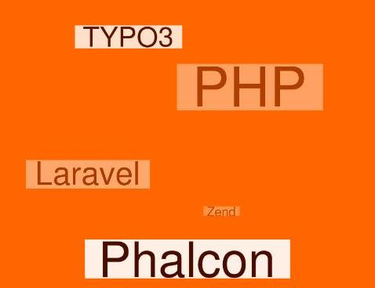

=====================================================
.. FOR YOUR INFORMATION
.. --------------------------------------------------
.. -*- coding: utf-8 -*- with BOM.

.. include:: ../Includes.txt

What does it do?
================

Tag cloud is an user friendly extension to generate tag clouds. The tags can be either manually created with links or it can be taken from various fields of existing database tables.

The Tag cloud can be made colourful and attractive. The weight of manually added tags can be specified for each tag. Whereas the weight (font-size) for tags from tables is generated automatically according to its number of occurances in the respective tables.

You can insert multiple tag clouds in a page.

The extension uses tagCanvas for rendering animated tags.

	An example tag cloud.

