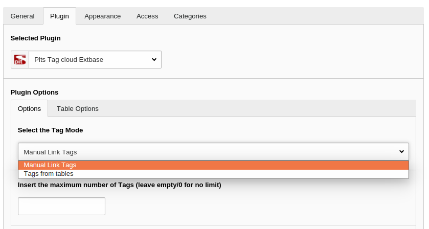
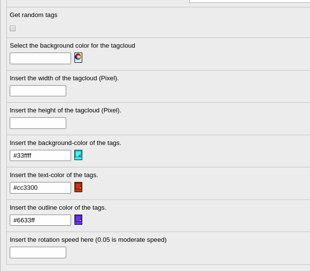
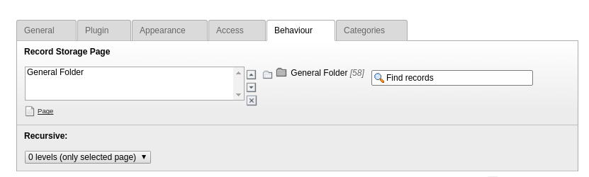
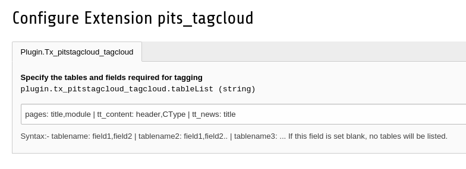

.. ==================================================
.. FOR YOUR INFORMATION
.. --------------------------------------------------
.. -*- coding: utf-8 -*- with BOM.

.. include:: ../../Includes.txt

.. _configuration:

Configuration
==============

	Choose the plugin options.

The plugin has two options for tag mode:
    1. Manual link tags.
    2. Tags from tables.

General Options
----------------

	General options.

1. Insert the maximum number of Tags - If you have too many tags and you want to limit it to a certain number, you can specify it here.

2. Get random tags - To display tags randomly.

3. Select the background color for the pits_tagcloud -pick any colour of your choice.

4. Insert the width/height of the pits_tagcloud (Pixel) - height and width of the tag cloud.

5. Insert the background-color/text-color/ outline-color of the tags - Pick any color of your choice.

6. Insert the rotation speed here- Give any value within the given range. 0.09 is set as default.

Manual Link tags
================
You can create tags of your choice with this option.

Step1: Create a folder/Choose a page where you can create tags.
-----

Step2: Go to the list view and add new items 'Tags'.
-----

* Tag Text - Name of tag (mandatory)
* Tag Link url - The link to which the tag points to when clicking.
* Tag size - The size of the tag(default is 10px and maximum is 100px)

	Create tags.

Step3: Save your tag and create as many as you want.
-----

Step4: Choose this folder/page as the Record storage page.
-----

Other Options
---------------

	Select the tags from list

* Pick the tags to be displayed - Here you can pick the tags to be displayed out of all the tags available from the table. Only the picked tags will be displayed in frontend. If you dont pick any, all tags will be displayed.

Tags from Table
===============

You can create tags out of the field values from existing database tables. Follow the steps carefully to configure it.

Step1:
------
Go to extension manager and click on the configuration settings of the tag cloud extension.

Step2:
------
Here you can specify the table and the fields to be chosen for tagging. So that you can manage the list of the fields in the Available items list.

This has to be written in a specific syntax: Seperate fields by comma and tables with | character.

Syntax : tablename1: field1,field2,field3 | tablename2: field1,field2
------

Example: pages: title | tt_content: header,list_type

	Configuration

Step3:
------
Go to the plugin option and choose the 'Tags from table' tag mode.

Step4:
------
In the table option tab. Choose the table and select the respective fields.

	Select the table and fileds.

Other Options
--------------

	Limiting the words for tags

1. Input the maximum words in tag - if the displayed text is too long, you can cut down the number of words to be displayed in the tag.

2. Select the target page - If you set any target page, then all tags will point(link) to this page.

You can set the links manually for each table and you can exclude certain uids from tags using typoscript. The next chapter explains this.

.. toctree::
	:maxdepth: 5
	:titlesonly:
	:glob:

	Configuration/Typoscript/Index

