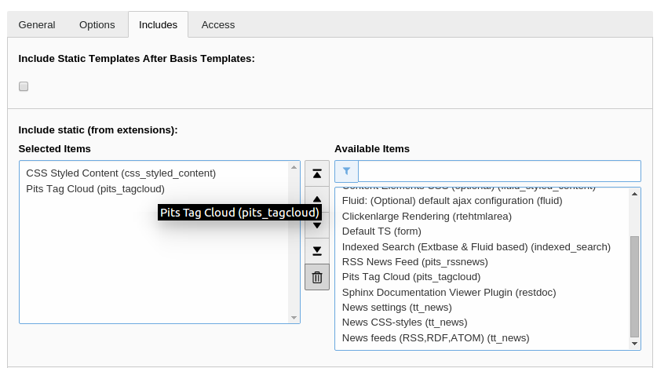

.. ==================================================
.. FOR YOUR INFORMATION
.. --------------------------------------------------
.. -*- coding: utf-8 -*- with BOM.

.. include:: ../Includes.txt

.. _users-manual:

Users manual
============

This section specifies how to use the tag cloud extension.
The extension works in TYPO3 6.2.0 - 7.6.4

Installation
------------

* You can install the extension using extension manager.
* Add the plugin to the template's include static templates lists.

	Include in template.

* Add the plugin as a page content and configure it accordingly.

Check the configuration section to know how to configure the plugin.

.. toctree::
	:maxdepth: 5
	:titlesonly:
	:glob:

	UsersManual/Index
	Configuration/Index
	Configuration/Typoscript/Index